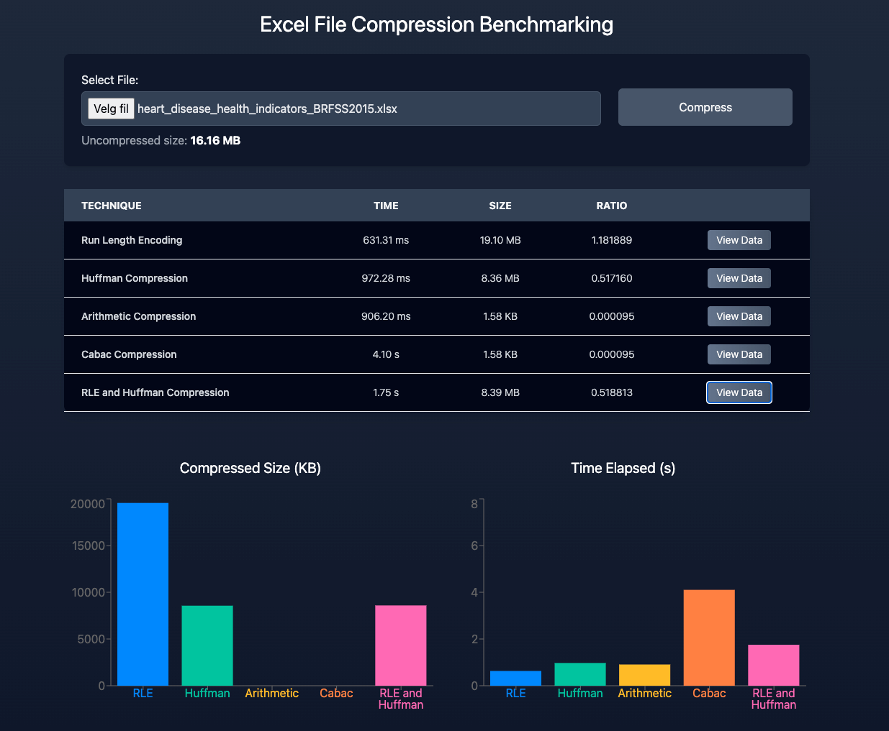

# Lossless Benchmarking

A React-based web application for comparing and benchmarking lossless compression algorithms on Excel files. This frontend provides an intuitive interface to upload files and visualize performance results to help determine which compression algorithm performs best for your data.



## Features

- **Algorithm Comparison**: Compare multiple lossless compression algorithms side-by-side
- **File Upload Interface**: Drag-and-drop Excel file upload (.xls, .xlsx)
- **Real-time Results**: View compression metrics with interactive charts
- **Performance Visualization**: Compare compression ratios, processing times, and file sizes
- **Responsive Design**: Built with Tailwind CSS for all device sizes

## Tech Stack

- **React 18** - Modern React with hooks
- **Vite** - Fast build tool and development server  
- **Tailwind CSS** - Utility-first CSS framework
- **Recharts** - Composable charting library for React
- **React Spinners** - Loading indicators

## Requirements

- Node.js 16+
- npm or yarn

## Installation

1. Clone the repository:
   ```bash
   git clone https://github.com/madeleinewoodbury/lossless-benchmarking.git
   cd lossless-benchmarking
   ```

2. Install dependencies:
   ```bash
   npm install
   ```

## Usage

**Prerequisites**: The [Lossless Benchmark API](https://github.com/madeleinewoodbury/lossless-benchmark-api) must be running on `http://localhost:8000` for this application to function.

1. Start the development server:
   ```bash
   npm run dev
   ```

2. Open your browser to `http://localhost:3000`

3. Upload an Excel file and select compression algorithms to benchmark

## Available Scripts

- `npm run dev` - Start development server
- `npm run build` - Build for production
- `npm run preview` - Preview production build
- `npm run lint` - Run ESLint
- `npm run format` - Format code with Prettier

## API Integration

This frontend connects to the [Lossless Benchmark API](https://github.com/madeleinewoodbury/lossless-benchmark-api) for compression processing. Make sure the API is running on `http://localhost:8000` before using the application.

### API Endpoints Used

- `GET /compressions` - Fetch available compression techniques
- `POST /compression/{id}` - Submit files for compression benchmarking

## Related Projects

- **API**: [Lossless Benchmark API](https://github.com/madeleinewoodbury/lossless-benchmark-api) - FastAPI backend for compression processing
